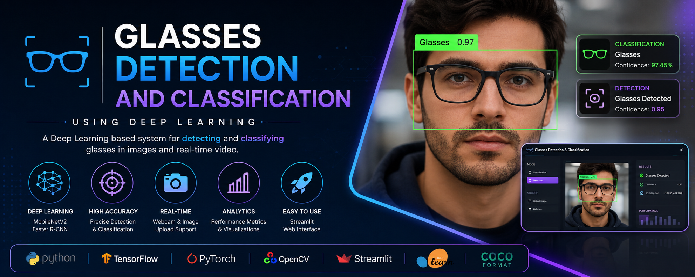
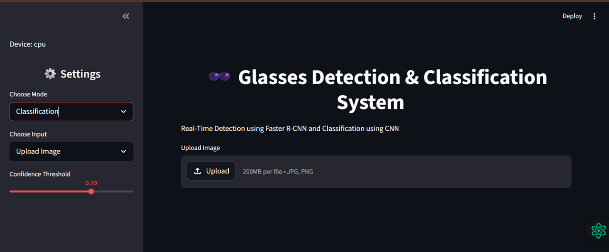

# 🕶️ Glasses Detection and Classification System

<p align="center">
  
</p>

<p align="center">


</p>

<p align="center">

**A Deep Learning-based Computer Vision System for Real-Time Glasses Classification and Detection using MobileNetV2, Faster R-CNN, TensorFlow, PyTorch, and Streamlit.**

</p>

---

# 📖 Overview

The **Glasses Detection and Classification System** is a Deep Learning-based Computer Vision project developed to identify whether a person is wearing glasses and accurately locate the glasses within an image.

Unlike traditional image classification systems that only predict a class label, this project combines **Classification** and **Object Detection** to provide a complete vision-based solution.

Two independent Deep Learning models were developed:

- **MobileNetV2** for binary image classification (Glasses / No Glasses)
- **Faster R-CNN with ResNet50-FPN** for object detection and localization

The project also includes a modern **Streamlit Web Application**, allowing users to upload images or use a webcam for real-time predictions.

This project was developed as part of the **Neural Networks** course using modern Computer Vision and Deep Learning techniques.

---

# 🎯 Objectives

The primary objectives of this project are:

- Develop an intelligent glasses classification system.
- Detect the presence of glasses using Deep Learning.
- Localize glasses with accurate bounding boxes.
- Train separate models for classification and detection.
- Compare image classification with object detection.
- Build a real-time Streamlit application.
- Support webcam and image upload functionality.
- Provide a simple and user-friendly interface.
- Demonstrate practical applications of Computer Vision.

---

# ✨ Features

## 👓 Classification

- Binary Image Classification
- MobileNetV2 Architecture
- Glasses / No Glasses Prediction
- TensorFlow & Keras Implementation
- High-Speed Inference

---

## 🎯 Detection

- Faster R-CNN Object Detector
- ResNet50 Feature Extractor
- Accurate Bounding Box Detection
- Confidence Score Prediction
- PyTorch Implementation

---

## 💻 Streamlit Application

- Upload Image
- Live Webcam
- Classification Mode
- Detection Mode
- Interactive User Interface
- Real-Time Prediction

---

## 📊 Visualization

- Prediction Results
- Bounding Boxes
- Confidence Scores
- Performance Metrics
- Confusion Matrix
- Accuracy Graphs

---


## Overall Workflow

```text
                   Input Image / Webcam
                            │
                            ▼
                    Image Preprocessing
          (Resize • Normalize • Convert Tensor)
                            │
              ┌─────────────┴─────────────┐
              │                           │
              ▼                           ▼

      MobileNetV2 CNN             Faster R-CNN
      Classification              Object Detection

              │                           │
              ▼                           ▼

     Glasses / No Glasses      Bounding Box + Label
              │                           │
              └─────────────┬─────────────┘
                            ▼
                  Streamlit User Interface
```

---

# 🧠 Deep Learning Pipeline

The complete project follows a standard Computer Vision workflow from dataset preparation to deployment.

```text
Dataset Collection
        │
        ▼
Data Augmentation
        │
        ▼
Image Preprocessing
        │
        ▼
Model Training
        │
 ┌──────┴────────┐
 ▼               ▼

MobileNetV2   Faster R-CNN

 ▼               ▼

Evaluation & Testing
        │
        ▼
Model Saving
        │
        ▼
Streamlit Deployment
        │
        ▼
Real-Time Prediction
```

---

# 🖼️ Application Workflow

The Streamlit application supports two operating modes.

## Classification Workflow

```text
Upload Image / Webcam
          │
          ▼
Image Preprocessing
          │
          ▼
MobileNetV2 Model
          │
          ▼
Glasses / No Glasses
          │
          ▼
Display Prediction
```

---

## Detection Workflow

```text
Upload Image / Webcam
          │
          ▼
Image Preprocessing
          │
          ▼
Faster R-CNN Model
          │
          ▼
Bounding Box Detection
          │
          ▼
Confidence Score
          │
          ▼
Display Final Output
```

---

# 🚀 Technologies Used

| Technology | Purpose |
|------------|---------|
| Python | Programming Language |
| TensorFlow | Classification Model |
| Keras | Deep Learning Framework |
| PyTorch | Detection Model |
| Torchvision | Faster R-CNN |
| OpenCV | Image Processing |
| Streamlit | Web Application |
| NumPy | Numerical Operations |
| Matplotlib | Visualization |
| Scikit-Learn | Evaluation Metrics |
| Pillow | Image Loading |

---

# 🎯 Why Two Different Models?

This project combines **Image Classification** and **Object Detection**, which solve different Computer Vision tasks.

| Classification | Detection |
|---------------|-----------|
| Identifies whether glasses exist | Identifies and locates glasses |
| Predicts only class label | Predicts class + bounding box |
| Faster inference | Higher localization accuracy |
| MobileNetV2 | Faster R-CNN |
| TensorFlow | PyTorch |

Using two specialized models provides better performance for each task while demonstrating different Deep Learning approaches.

---

# 📊 Dataset

To train robust Deep Learning models, two separate datasets were prepared: one for **Image Classification** and another for **Object Detection**.

---

## 👓 Classification Dataset

The classification dataset was created to determine whether a person is wearing glasses.

### Classes

| Class | Description |
|--------|-------------|
| 👓 Glasses | Person wearing glasses |
| 🙂 No Glasses | Person without glasses |

### Dataset Statistics

| Description | Count |
|------------|------:|
| Original Images | ~150 |
| Augmented Images | ~1000 |
| Image Size | 224 × 224 |
| Number of Classes | 2 |

The dataset was divided into:

- Training Set
- Validation Set
- Testing Set

---

## 🎯 Detection Dataset

The detection dataset was created for locating glasses using bounding boxes.

Each image was manually annotated using **Roboflow**.

### Dataset Statistics

| Description | Count |
|------------|------:|
| Original Images | ~203 |
| Augmented Images | ~1000 |
| Annotation Format | COCO JSON |
| Classes | Glasses |

The dataset contains:

- Training Set
- Validation Set
- Testing Set

---

# 🔄 Data Augmentation

Deep Learning models require large datasets for better generalization. Since the original datasets were relatively small, several augmentation techniques were applied.

### Classification Augmentation

- Rotation
- Horizontal Flip
- Zoom
- Brightness Adjustment
- Random Translation
- Shearing

---

### Detection Augmentation

- Horizontal Flip
- Rotation
- Brightness Change
- Contrast Adjustment
- Blur
- Random Scaling

---

## Benefits of Data Augmentation

- Increased dataset size
- Reduced overfitting
- Improved robustness
- Better model generalization
- Enhanced performance on unseen images

---

# 🧠 Classification Model

## MobileNetV2 Architecture

MobileNetV2 is a lightweight Convolutional Neural Network (CNN) specifically designed for efficient image classification.

It was selected because it provides excellent accuracy while maintaining low computational complexity, making it suitable for real-time applications.

---

## MobileNetV2 Workflow

```text
Input Image (224×224×3)
        │
        ▼
Initial Convolution Layer
        │
        ▼
Inverted Residual Blocks
        │
        ▼
Depthwise Convolution
        │
        ▼
Projection Layer
        │
        ▼
Global Average Pooling
        │
        ▼
Dense Layer
        │
        ▼
Sigmoid Activation
        │
        ▼
Glasses / No Glasses
```

---

## Why MobileNetV2?

✔ Lightweight Architecture

✔ Fast Inference

✔ Low Memory Consumption

✔ Suitable for CPU Deployment

✔ High Classification Accuracy

✔ Real-Time Performance

---

## Classification Training Pipeline

```text
Dataset
     │
     ▼
Image Resize (224×224)
     │
     ▼
Normalization
     │
     ▼
Data Augmentation
     │
     ▼
MobileNetV2
     │
     ▼
Training
     │
     ▼
Validation
     │
     ▼
Testing
     │
     ▼
Model Saved (.h5 / .keras)
```

---

## Classification Training Configuration

| Parameter | Value |
|-----------|-------|
| Model | MobileNetV2 |
| Framework | TensorFlow |
| Image Size | 224 × 224 |
| Classes | 2 |
| Optimizer | Adam |
| Loss Function | Binary Cross Entropy |
| Epochs | 10 |
| Batch Size | 32 |
| Output | Glasses / No Glasses |

---

# 🎯 Detection Model

## Faster R-CNN Architecture

Faster R-CNN is a two-stage object detection model designed for high localization accuracy.

Unlike image classification, Faster R-CNN predicts both the object class and its exact location using bounding boxes.

---

## Faster R-CNN Workflow

```text
Input Image
      │
      ▼
ResNet50 Backbone
      │
      ▼
Feature Maps
      │
      ▼
Region Proposal Network (RPN)
      │
      ▼
ROI Pooling
      │
      ▼
Classification Head
      │
      ▼
Bounding Box Regressor
      │
      ▼
Final Detection
```

---

## Why Faster R-CNN?

✔ High Detection Accuracy

✔ Precise Bounding Boxes

✔ Strong Localization Performance

✔ Robust Small Object Detection

✔ Widely Used in Research

---

## Detection Training Pipeline

```text
Annotated Dataset
        │
        ▼
Data Augmentation
        │
        ▼
Image Transformations
        │
        ▼
Faster R-CNN
        │
        ▼
Training
        │
        ▼
Validation
        │
        ▼
Testing
        │
        ▼
Model Saved (.pth)
```

---

## Detection Training Configuration

| Parameter | Value |
|-----------|-------|
| Model | Faster R-CNN |
| Backbone | ResNet50-FPN |
| Framework | PyTorch |
| Classes | 2 (Background + Glasses) |
| Optimizer | Adam |
| Learning Rate | 0.0001 |
| Batch Size | 2 |
| Epochs | 10 |
| Annotation Format | COCO JSON |

---

# 📈 Evaluation Metrics

Both models were evaluated using standard Computer Vision metrics.

---

## Classification Metrics

- Accuracy
- Precision
- Recall
- F1 Score
- Confusion Matrix
- ROC Curve

---

## Detection Metrics

- Precision
- Recall
- F1 Score
- Intersection over Union (IoU)
- Confusion Matrix
- Detection Loss Curve

---

# 📋 Model Performance Evaluation

### Classification

The MobileNetV2 model predicts whether a person is wearing glasses.

Performance was evaluated using:

- Accuracy
- Precision
- Recall
- F1 Score

---

### Detection

The Faster R-CNN model predicts:

- Presence of glasses
- Bounding box coordinates
- Confidence score

Performance was evaluated using:

- Precision
- Recall
- IoU
- F1 Score
- Confusion Matrix

---

# 💾 Model Outputs

## Classification

```
Input Image
        │
        ▼
Prediction

✔ Glasses

or

✔ No Glasses
```

---

## Detection

```
Input Image
        │
        ▼
Prediction

Bounding Box

Class Label

Confidence Score
```

---

# 📦 Saved Models

After successful training, the trained models were saved for deployment.

| Model | Format | Purpose |
|--------|---------|---------|
| MobileNetV2 | `.h5` | Classification |
| MobileNetV2 | `.keras` | Classification |
| Faster R-CNN | `.pth` | Object Detection |

These trained models are loaded directly into the Streamlit application for real-time inference.

---

# 💻 Streamlit Web Application

The project includes a modern **Streamlit-based graphical user interface (GUI)** that enables users to perform both **Classification** and **Detection** in real time.

The application provides an intuitive interface for testing trained models without writing any code.

---

## 🚀 Application Features

### 👓 Classification Mode

- Upload Image
- Live Webcam
- Predict Glasses / No Glasses
- Confidence Score
- Fast Real-Time Prediction

---

### 🎯 Detection Mode

- Upload Image
- Live Webcam
- Detect Glasses
- Draw Bounding Boxes
- Display Confidence Score

---

## 🖥️ Application Workflow

```text
                Start Application
                       │
                       ▼
              Select Operation Mode
             ┌──────────┴──────────┐
             ▼                     ▼

      Classification         Detection

             ▼                     ▼

 Upload Image / Webcam  Upload Image / Webcam

             ▼                     ▼

      MobileNetV2         Faster R-CNN

             ▼                     ▼

 Prediction Result     Bounding Box Detection

             └──────────┬──────────┘
                        ▼

             Display Final Output
```

---

# 📂 Project Structure

```text
Glasses-Detection-and-Classification
│
├── app.py
├── requirements.txt
├── README.md
├── LICENSE
├── .gitignore
│
├── models
│   ├── glasses_classifier.h5
│   ├── glasses_model.keras
│   ├── model_download_links.txt
│   └── faster_rcnn_glasses.pth
│
├── notebooks
│   ├── NNFL_Glasses_Classification.ipynb
│   └── Glasses_Detection.ipynb
│
├── dataset
│   └── dataset_link.txt
│
├── docs
│   ├── Project_Report.pdf
│   └── Presentation.pdf
│
├── images
│   ├── banner.png
│   ├── architecture.png
│   ├── app_home.png
│   ├── classification_result.png
│   ├── detection_result.png
│   ├── confusion_matrix.png
│   ├── loss_curve.png
│   └── metrics_graph.png
│
├── outputs
│   ├── detection_output.jpg
│   ├── classification_output.jpg
│   └── prediction_results.png
│
└── sample_images
    ├── sample1.jpg
    ├── sample2.jpg
    └── sample3.jpg
```

---

# ⚙️ Installation

## 1️⃣ Clone Repository

```bash
git clone https://github.com/Abdul-Wahab1010/Glasses-Detection-and-Classification.git
```

Move into project directory

```bash
cd Glasses-Detection-and-Classification
```

---

## 2️⃣ Create Virtual Environment

Windows

```bash
python -m venv venv
```

Linux / macOS

```bash
python3 -m venv venv
```

---

## 3️⃣ Activate Virtual Environment

Windows

```bash
venv\Scripts\activate
```

Linux

```bash
source venv/bin/activate
```

---

## 4️⃣ Install Dependencies

```bash
pip install -r requirements.txt
```

---

## 5️⃣ Download Models

Download the trained models from

```text
models/model_download_links.txt
```

Move the downloaded files into the

```text
models/
```

directory.

---

## 6️⃣ Download Dataset

Dataset download links are available in

```text
dataset/dataset_link.txt
```

---

## ▶️ Run the Application

Launch the Streamlit application:

```bash
streamlit run app.py
```

The application will automatically open in your default web browser.

---

# 🧪 Testing the Application

## Classification

1. Select **Classification Mode**
2. Upload an image or start the webcam
3. The model predicts:

```
✔ Glasses

or

✔ No Glasses
```

---

## Detection

1. Select **Detection Mode**
2. Upload an image or use the webcam
3. The application displays:

- Bounding Box
- Confidence Score
- Detection Result

---

# 📈 Results

The developed system successfully demonstrates:

## Classification

✔ Binary Image Classification

✔ High Prediction Accuracy

✔ Fast Inference

✔ Real-Time Webcam Support

---

## Detection

✔ Accurate Glasses Detection

✔ Bounding Box Localization

✔ Confidence Score Prediction

✔ Multiple Object Support

---

## Deployment

✔ Interactive Streamlit Dashboard

✔ Image Upload Support

✔ Webcam Support

✔ User-Friendly Interface

---

# 📊 Performance Graphs

The project evaluates both models using several visualization techniques.

## Classification

- Accuracy Curve
- Loss Curve
- ROC Curve
- Confusion Matrix
- Precision
- Recall
- F1 Score

---

## Detection

- Detection Loss Curve
- IoU Distribution
- Precision
- Recall
- F1 Score
- Confusion Matrix

---

# 📸 Project Screenshots

## 🏠 Home Screen

<p align="center">

</p>

---

## 👓 Classification Result

<p align="center">

</p>
<p align="center">

</p>
<p align="center">

</p>
---

## 🎯 Detection Result

<p align="center">

</p>
<p align="center">

</p>

---

## 📊 Confusion Matrix

<p align="center">

</p>

---

## 📉 Training Loss Curve

<p align="center">

</p>

---

## 📈 Performance Metrics

<p align="center">

</p>

---

# 📥 Download Models

Due to GitHub's file size limitations, trained models are not included in this repository.

Download links are available in:

```text
models/model_download_links.txt
```

---

# 📥 Download Datasets

The datasets used for this project are available through Google Drive.

Dataset download links can be found in:

```text
dataset/dataset_link.txt
```

After downloading:

- Extract the datasets.
- Place them in your preferred location.
- Update dataset paths in the notebooks if required.

---

# 📚 Documentation

The repository also contains project documentation.

```text
docs/
```

Contents:

- Presentation Slides

These documents provide a detailed explanation of the project methodology, implementation, training process, and evaluation.

---

# 🔮 Future Improvements

Although the current system performs both classification and detection effectively, several enhancements can further improve its capabilities.

## Planned Features

- 🔍 Implement YOLOv11 for faster real-time object detection.
- 😎 Add support for multiple glasses categories (Sunglasses, Reading Glasses, Safety Glasses).
- 👥 Detect multiple people simultaneously.
- 📱 Develop an Android application for mobile inference.
- 🌐 Deploy the application on Streamlit Cloud or Hugging Face Spaces.
- ☁️ Cloud-based model inference using REST APIs.
- 📹 Real-time video analytics for surveillance applications.
- 😊 Integrate Face Recognition for identity-aware glasses detection.
- 🎥 Improve webcam performance using multithreading.
- 🧠 Experiment with Vision Transformers (ViT) and EfficientNet models.
- 📊 Add Grad-CAM visualization for explainable AI.
- ⚡ Optimize Faster R-CNN using TensorRT or ONNX for faster inference.

---

# 🎯 Applications

The proposed system can be applied in multiple real-world scenarios.

- 👓 Smart Surveillance Systems
- 🏢 Office Attendance Systems
- 🏫 Educational Institutions
- 🏥 Healthcare Monitoring
- 🚗 Driver Monitoring Systems
- 🛡️ Security & Access Control
- 🧑‍💻 Human-Computer Interaction
- 🤖 Computer Vision Research
- 📷 Smart Camera Applications

---

# 🎓 Academic Information

### Project Title

**Glasses Detection and Classification System Using Deep Learning**

---

### Course

**Neural Networks**

---

### Technologies

- TensorFlow
- Keras
- PyTorch
- Faster R-CNN
- MobileNetV2
- OpenCV
- Streamlit
- Python

---

### Project Type

Computer Vision

Deep Learning

Machine Learning

---

# 📚 References

This project was developed using knowledge from the following technologies and libraries.

- TensorFlow Documentation
- PyTorch Documentation
- Torchvision Documentation
- OpenCV Documentation
- Streamlit Documentation
- Scikit-Learn Documentation
- Roboflow
- Google Colab
- Kaggle
- COCO Dataset Format

---

# 📦 Requirements

Major Python libraries used in this project include:

```text
streamlit
tensorflow
torch
torchvision
opencv-python
numpy
matplotlib
pillow
scikit-learn
```

Install all dependencies using

```bash
pip install -r requirements.txt
```

---

# 💡 Project Highlights

✔ Deep Learning Project

✔ Computer Vision Application

✔ Image Classification

✔ Object Detection

✔ MobileNetV2

✔ Faster R-CNN

✔ TensorFlow

✔ PyTorch

✔ OpenCV

✔ Streamlit GUI

✔ Real-Time Webcam

✔ Image Upload

✔ Professional GitHub Repository

---

# 📊 Repository Statistics

| Feature | Description |
|----------|-------------|
| Programming Language | Python |
| Classification Framework | TensorFlow / Keras |
| Detection Framework | PyTorch |
| Image Processing | OpenCV |
| GUI | Streamlit |
| Object Detector | Faster R-CNN |
| Image Classifier | MobileNetV2 |
| Dataset Type | Custom Dataset |
| Annotation Format | COCO JSON |
| Deployment | Local Streamlit |

---

# 👨‍💻 Author

## Wahab Ul Hassan Subhani

**Computer Engineering Student**

Department of Electrical & Computer Engineering

Faculty of Engineering & Technology

International Islamic University Islamabad (IIUI)

---

### GitHub

https://github.com/Abdul-Wahab1010

---

### LinkedIn

https://www.linkedin.com/in/wahab-ul-hassan-subhani-44022b2bb/

---

### Email

> Add your professional email here

Example:

```
wahabulhassansubhani@gmail.com
```

---

# 🤝 Contributions

Contributions are welcome!

If you would like to improve this project:

1. Fork this repository
2. Create a new feature branch
3. Commit your changes
4. Push to your fork
5. Submit a Pull Request

---

# ⭐ Support

If you found this project useful,

please consider giving it a ⭐ on GitHub.

Your support motivates future development.

---

# 📄 License

This project is licensed under the **MIT License**.

```
MIT License

Copyright (c) 2026 Abdul Wahab

Permission is hereby granted, free of charge,
to any person obtaining a copy of this software
and associated documentation files (the "Software"),
to deal in the Software without restriction,
including without limitation the rights to use,
copy, modify, merge, publish, distribute,
sublicense, and/or sell copies of the Software.
```

See the LICENSE file for more information.

---

# 🙏 Acknowledgements

Special thanks to:

- TensorFlow Team
- PyTorch Team
- OpenCV Developers
- Streamlit Developers
- Roboflow
- Google Colab
- Scikit-Learn
- Kaggle Community
- Open Source Computer Vision Community

---

# ❤️ Thank You

Thank you for visiting this repository.

I hope this project helps students, researchers, and developers interested in **Computer Vision**, **Deep Learning**, and **Artificial Intelligence**.

Feel free to explore, fork, improve, and contribute.

---

<p align="center">

### ⭐ If you like this project, don't forget to Star the Repository ⭐

</p>

<p align="center">

Made with ❤️ by **Wahab Ul Hassan**

</p>
